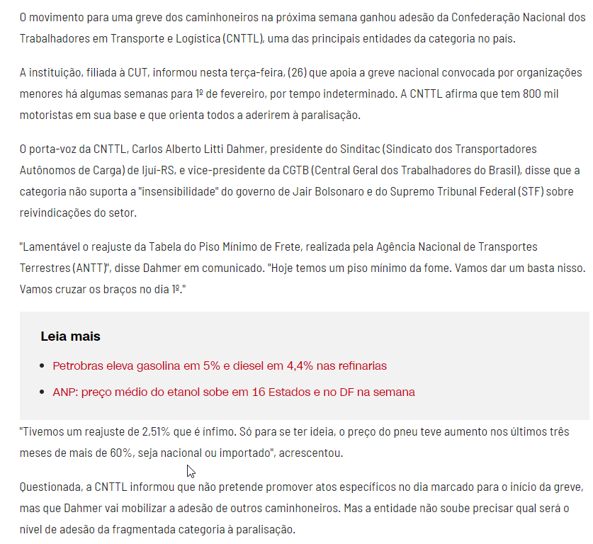
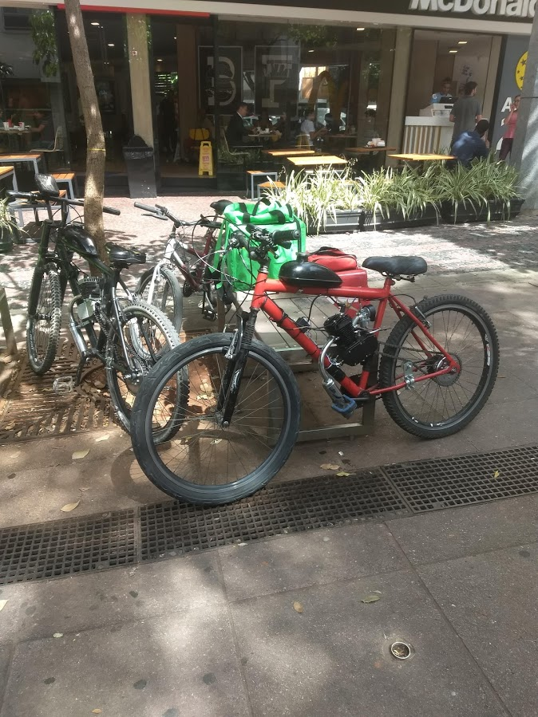
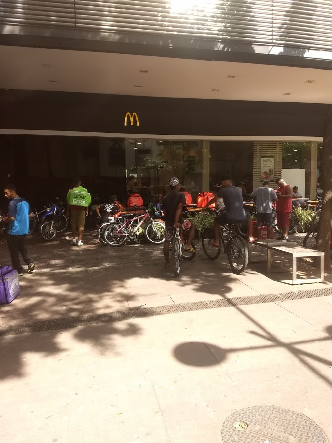

```{r child = "setup.Rmd"}
```

```{r xaringan-tile-view, echo=FALSE}
xaringanExtra::use_tile_view()
```

```{r xaringan-editable, echo=FALSE}
xaringanExtra::use_editable(expires = 1)
```

```{r xaringan-panelset, echo=FALSE, message=FALSE, warning=FALSE}
xaringanExtra::use_panelset()
xaringanExtra::style_panelset_tabs(panel_tab_font_family = "sans-serif")
```

```{r xaringanExtra-clipboard, echo=FALSE}
htmltools::tagList(
  xaringanExtra::use_clipboard(
    button_text = "<i class=\"fa fa-clipboard\"></i>",
    success_text = "<i class=\"fa fa-check\" style=\"color: #90BE6D\"></i>",
    error_text = "<i class=\"fa fa-times-circle\" style=\"color: #F94144\"></i>"
  ),
  rmarkdown::html_dependency_font_awesome()
)
```

```{r xaringan-fit-screen, echo=FALSE}
xaringanExtra::use_fit_screen()
```

```{r xaringan-extra-styles, echo=FALSE}
xaringanExtra::use_extra_styles(
  hover_code_line = TRUE,         #<<
  mute_unhighlighted_code = TRUE  #<<
)
```

```{css include=FALSE}
.panelset {
   --panel-tab-foreground: currentColor;
   --panel-tab-background: unset;
   --panel-tab-active-foreground: currentColor;
   --panel-tab-active-background: unset;
   --panel-tab-active-border-color: currentColor;
   --panel-tab-hover-foreground: currentColor;
   --panel-tab-hover-background: unset;
   --panel-tab-hover-border-color: currentColor;
   --panel-tab-inactive-opacity: 0.5;
   --panel-tabs-border-bottom: #ddd;
   --panel-tab-font-family: Sen;
   --panel-tab-background-color-active: #fffbe0;
   --panel-tab-border-color-active: #023d4d;
}

.panelset .panel-tabs .panel-tab > a {
	color: #023d4d;
}

.panelset .panel-tabs {
  font-size: 0.5rem;
}
```

## Grupos de trabalho
.large[
.pink[ 

**Grupo 1:** Caíque Alves França, Diego de Freitas Goes e Silva, Igor Felipe Eduardo Ferreira, Luiz Pedro Xavier Carvalho   

**Grupo 2:** Vitor Abrantes, Ana Luiza Cuha, Alexandre Roberto, Gustavo Martins

**Grupo 3:** Luis, Joyce e Warlley

**Grupo 4:** Ingrid, Agatha e Luiza

**Grupo 5:** Izabela,   

]
]

---
class: center, middle

## Retrospecto

---

## Definições

### Logística

.midi[
.question[
“**Logística** é dispor a **mercadoria ou o serviço** certo, no **lugar** certo, no **tempo** certo e nas **condições desejadas**, ao mesmo tempo em que fornece a **maior contribuição à empresa**”. 
(Ballou, 2001)
]
]

### Gestão Cadeia de Suprimentos

.question[
.midi[
**Cadeia de suprimentos** é a estrutura consolidada e integrada, em níveis estratégico, tático e operacional, entre agentes de produção, mercadológicos, logísticos e sociedade, para que seja possível coordenar as operações de maneira a garantir a gestão orientada à logística, tendo como objetivo o _trade-off_ entre **responsividade** e **eficiência**, além de garantia de um contexto sustentável de desenvolvimento por ações **socialmente responsáveis** e **resilientes.** 
]
]

---

class: inverse, middle

# Exemplos de desafios reais e contemporâneos da gestão da cadeia de suprimentos

---

"O CEO da Cargo X, Federico Vega, conta que todo o processo é conduzido de forma **online**, desde a **contratação** ao **monitoramento** dos fretes. “O uso de **machine learning** aliado ao nosso **Big Data**, que possui informações de **rotas** e mais de **200 mil caminhoneiros cadastrados**, possibilita que tenhamos **ganhos significativos de eficiência** e **confiabilidade** para gerar o **match** entre **oferta** e **demanda**”, afirma. (...)

Segundo Federico, atualmente, a Cargo X opera mais de **6 mil fretes por mês** com um **time de menos 150 pessoas** dedicados a operação. “**Não possuímos um único caminhão próprio**, fato impossível de se realizar sem o uso de tecnologia”, destaca o executivo.

No último trimestre, a **taxa de sinistro da empresa** foi **menor que 2%**, o que Federico atribui ao rigoroso processo de **gestão de risco** e **monitoramento 100% online**."

[Fonte](https://noticias.gs1br.org/logistica-4-0-tendencias-e-desafios-para-melhorar-a-eficiencia/)

---

```{r echo=FALSE, message=FALSE, warning=FALSE}
knitr::include_graphics("./img/greve2018.png")
```

---

```{r echo=FALSE, message=FALSE, warning=FALSE}

```
---

```{r echo=FALSE, message=FALSE, warning=FALSE}
knitr::include_graphics("./img/greve2018c.png")
```
---

```{r echo=FALSE, message=FALSE, warning=FALSE, out.width="120%"}
knitr::include_graphics("./img/greve.png")
```


---

```{r echo=FALSE, message=FALSE, warning=FALSE, out.width="120%"}
knitr::include_graphics("./img/vac2.png")
```

---

```{r echo=FALSE, message=FALSE, warning=FALSE, out.width="120%"}
knitr::include_graphics("./img/vac1.png")
```


---

```{r echo=FALSE, message=FALSE, warning=FALSE}
knitr::include_graphics("./img/cam.png")
```

[Fonte](https://www.cnnbrasil.com.br/business/2021/01/26/chamado-de-greve-dos-caminhoneiros-ganha-apoio-de-confederacao-cnttl)

---

```{r echo=FALSE, message=FALSE, warning=FALSE}

```

---

```{r echo=FALSE, message=FALSE, warning=FALSE}
knitr::include_graphics("./img/cam3.png")
```

---

```{r echo=FALSE, message=FALSE, warning=FALSE}

```


```{r echo=FALSE, message=FALSE, warning=FALSE}

```

---

```{r echo=FALSE, message=FALSE, warning=FALSE}

```

---

```{r echo=FALSE, message=FALSE, warning=FALSE}

```

---

```{r echo=FALSE, message=FALSE, warning=FALSE}

```

---

```{r echo=FALSE, message=FALSE, warning=FALSE}
knitr::include_graphics("./img/bike5.jpg")
```

---

```{r echo=FALSE, message=FALSE, warning=FALSE}
knitr::include_graphics("./img/bike6.jpg")
```

---

```{r echo=FALSE, message=FALSE, warning=FALSE}
knitr::include_graphics("./img/bike7.jpg")
```

---


## Enquanto isso....

```{r echo=FALSE, message=FALSE, warning=FALSE}
knitr::include_graphics("./img/auto.png")
```

[Fonte](https://medium.com/@recogni/autonomous-vehicles-and-last-mile-delivery-2249bb16fdd7)

---

```{r echo=FALSE, message=FALSE, warning=FALSE}
knitr::include_graphics("./img/drone.png")
```

[Fonte](https://blogs.sw.siemens.com/thought-leadership/2020/04/16/autonomous-last-mile-delivery/)

---
<iframe width="900" height="506" src="https://www.youtube.com/embed/dagjQW_jgtE" frameborder="0" allow="accelerometer; autoplay; clipboard-write; encrypted-media; gyroscope; picture-in-picture" allowfullscreen></iframe>

---

<iframe width="900" height="506" src="https://www.youtube.com/embed/WKf-VDAHZi8" frameborder="0" allow="accelerometer; autoplay; clipboard-write; encrypted-media; gyroscope; picture-in-picture" allowfullscreen></iframe>

---

<iframe width="894" height="503" src="https://www.youtube.com/embed/NrmMk1Myrxc" frameborder="0" allow="accelerometer; autoplay; clipboard-write; encrypted-media; gyroscope; picture-in-picture" allowfullscreen></iframe>

---


class: middle, inverse

# Desempenho logístico

---

## KPIs

KPIs (Key Performance Indicators) - um indicador de desempenho deve demonstrar claramente que ação deve ser tomada e quando deve ser tomada.

- Os indicadores não podem ser individuais. 
- Atenção para medidas conflitantes, que podem acentuar os problemas das áreas ao invés de resolvê-los.

#### Quatro elementos fundamentais para medidas de desempenho
- **Parceria** com fornecedores, clientes e pessoal interno
- **Transferência** de poder para as pessoas das pontas
- **Integração** das medidas, relatórios e melhoria de **desempenho**
- **Conexão** das medidas de desempenho à **estratégia corporativa**

---

## O que medir?

### Responsividade x eficiência

- Eficiência - uso adequado de recursos   
- Responsividade mensurada por indicadores do processo
- Responsividade conforme percepção dos clientes

---

### Instalações

**Métricas relacionadas à instalação**

.midi[
- Capacidade   
- Utilização   
- Tempo ocioso de processamento/preparação/parada   
- Custo de produção por unidade    
- Perda de qualidade   
- Tempo de fluxo/ciclo teórico de produção   
- Tempo de fluxo/ciclo médio real   
- Eficiência de tempo de fluxo   
- Variedade de produtos   
- Contribuição de volume dos 20% maiores SKUs e clientes    
- Tamanho médio de lote de produção   
- Nível de serviço de produção   
]

---

### Estoque

**Métricas relacionadas a estoque**

.midi[
- Tempo cíclico C2C
- Estoque médio 
- Giro de estoque 
- Produtos com mais de um número específico de dias de estoque
- Tamanho médio de lote de reposição
- Estoque de segurança médio
- Estoque sazonal
- Taxa de atendimento
- Fração de tempo sem estoque
- Estoque obsoleto
]

---

### Transporte

**Métricas relacionadas a transporte**

.midi[
- Custo médio de transporte de recebimento   
- Tamanho médio de recebimento   
- Custo médio de transporte de recebimento por embarque   
- Custo médio de transporte do embarque   
- Tamanho médio de embarque   
- Custo médio de transporte de envio por embarque   
- Fração transportada por modo   
]

---

### Informação

**Métricas relacionadas à informação**

.midi[
- Horizonte de previsão   
- Frequência de atualização   
- Erro de previsão    
- Fatores sazonais   
- Fatores sazonais   
- Razão entre variabilidade da demanda e variabilidade do pedido   
]

---

### Sourcing

**Métricas relacionadas a Sourcing**

.midi[
- Dias pendentes de contas a pagar  
- Preço médio de compra  
- Faixa de preço de compra   
- Quantidade média de compra   
- Qualidade do fornecimento   
- Tempo de execução de fornecimento   
- Percentagem de entregas de imediato   
- Confiabilidade do fornecedor   
]

---

### Precificação

**Métricas relacionadas à precificação**

.midi[
- Margem de lucro   
- Dias de vendas pendentes   
- Custo fixo incremental por pedido   
- Custo variável incremental por unidade   
- Preço médio de venda   
- Tamanho médio de pedido   
- Faixa de preço de venda   
- Faixa de vendas periódicas   
]

---

class: center, middle

## Serviço ao cliente

---

## Serviço ao cliente

Todas as atividades necessárias para receber, aceitar, processar, enviar e faturar os pedidos dos clientes, controlar para que as atividades possam ser executadas em conformidade com o planejamento e assegurar-se que o cliente está satisfeito. O objetivo do serviço ao cliente é **CRIAR VALOR** para o cliente.

Os diferenciais competitivos nas operações logísticas são:

- Vantagem em CUSTO    
- Vantagem em VALOR


---

### Redução de custo
- Realizando uma boa gestão de estoques   
- Otimizando processos   
- Melhorando a produtividade   
- Introduzindo novas tecnologias   
- Otimizando recursos   
- Através da negociação com fornecedores   
- Utilizando modais alternativos   
- Otimizando utilização de espaços / transporte   

---

### Agregação de valor
- Disponibilizando o produto no momento desejado   
- Fazendo entregas rápidas   
- Sendo consistente nas entregas ao cliente   
- Aumentando a frequência de entrega   
- Tornando fácil o processo de compras   
- Disponibilizando informações confiáveis em tempo real   
- Oferecendo flexibilidade; local entrega, horário, embalagem, serviços especiais   
- Corrigindo rapidamente qualquer erro, ou reagindo a eventos não esperados   

---

> #Não há nenhum valor no produto ou serviço até estar nas mãos do cliente ou consumidor.

---

## Atividades da semana

Prazo | Atividade
------|----------
23/06/2021|[**Estudos Autônomos** - Nível de serviço logístico](https://retaoliveira.github.io/places/courses/log/est_1/)
28/06/2021|[**Estudos Autônomos** - KPI](https://retaoliveira.github.io/places/courses/log/est_2/)
28/06/2021|[**Projeto 1**](https://retaoliveira.github.io/places/courses/log/project1/)
Sem entrega|https://rpubs.com/retaoliveira/log1
Sem entrega|Revisitar a apresentação de hoje
Sem entrega|Ler e explorar a documentação no site referentes às **UNIDADE 1** e **UNIDADE 2** . 

---

class: center, middle

.larger[
**DÚVIDAS?**
]
